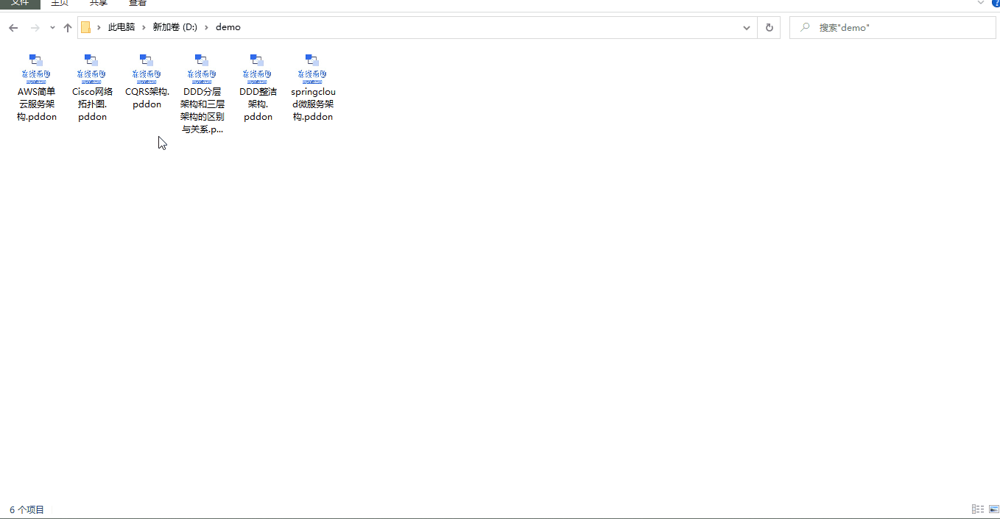
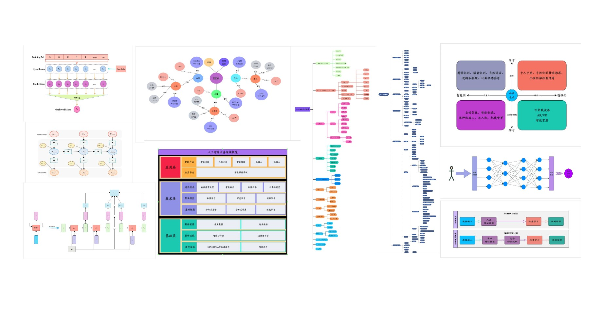
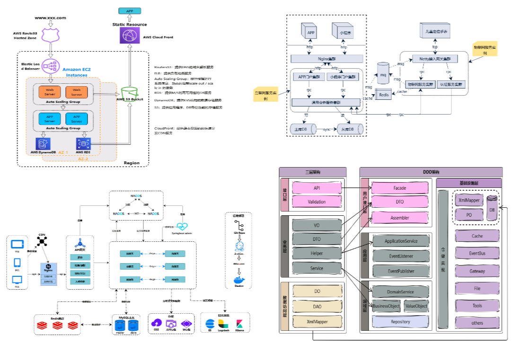
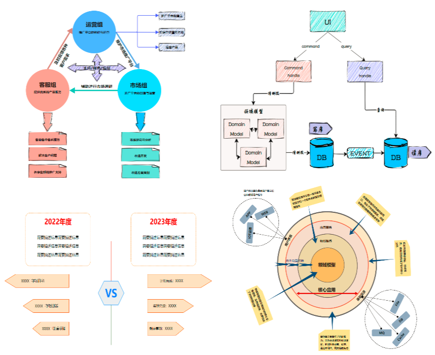
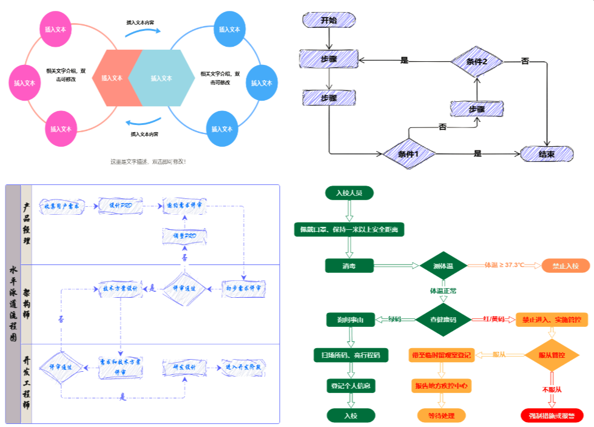
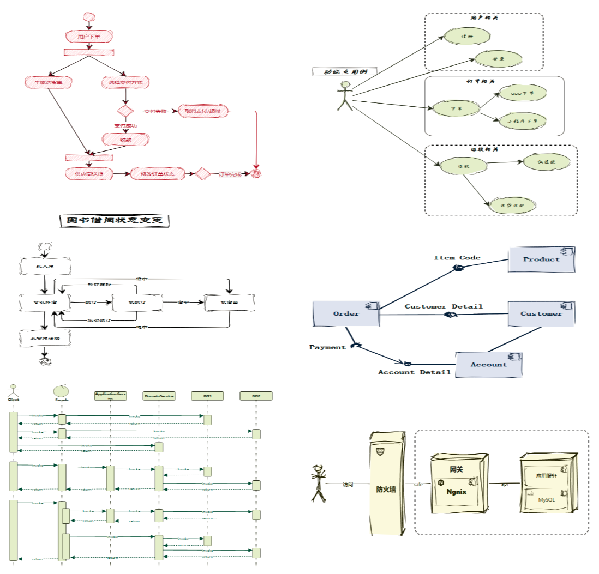
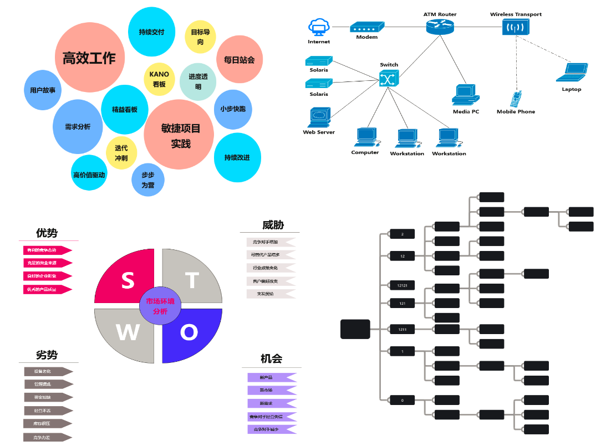
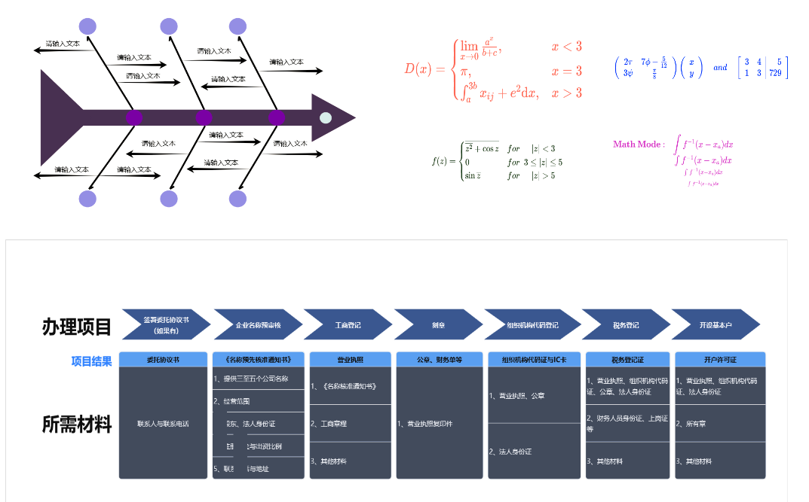
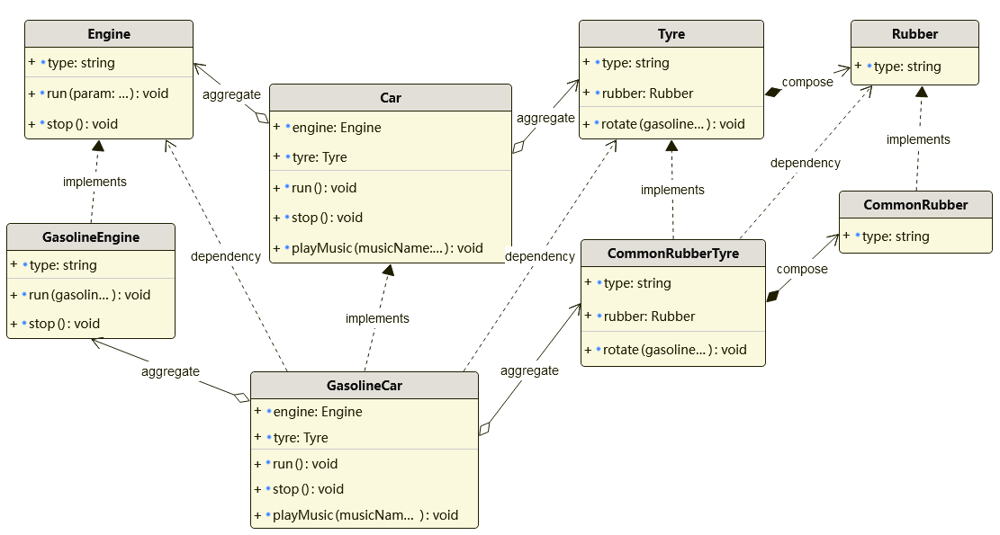
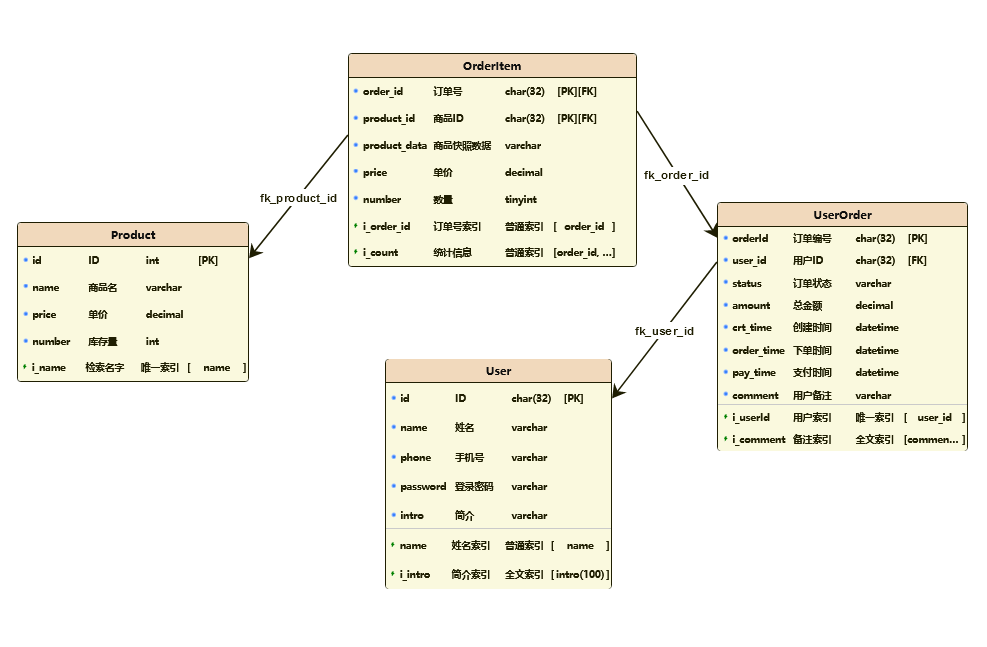

<h1>PDDON Free professional low code online drawing tool</h1>

If you are afraid of not drawing well, use PDDON. It can be used to draw process diagrams, architecture diagrams, mind maps, UML, BPMN, network topology diagrams, ER diagrams, database model diagrams, Wayne diagrams, fishbone diagrams, etc. It also supports object modeling, database modeling, and code/script generation, providing a rich library of customized drawing function components, bringing a more thoughtful and user-friendly design experience.

* Online drawing address: https://pddon.com
* Windows client download address: https://github.com/pddon/pddon-win/releases/latest
* Mac client download address: https://github.com/pddon/pddon-mac/releases/latest
* Linux client download address: https://github.com/pddon/pddon-linux/releases/latest
* aliyundrive download address: [https://www.aliyundrive.com/s/bjatcSHPaK4](https://www.aliyundrive.com/s/bjatcSHPaK4)
* [查看中文版文档](./README_zn.md)
> If you think it's useful, you can give it a star, thanks.

PDDON can be used to draw flow chart, architecture diagram, mind map, UML, BPMN, network topology diagram, ER diagram, database model diagram, Wayne diagram, fishbone diagram, Whiteboard drawing, etc.

 At the same time, it is very considerate to provide programmer users with object modeling, database modeling, code generation and other support, and it also supports the ability to modify the overall style, beautify the drawing, edit, layout, and Collaborative editing multiple design drawings with one key, similar to the simple operation mode of Excel. 

Support the input of Formula in the latex syntax, and support the drawing of freehand/sketch style drawings. A very rich set of connection styles and components are preset for selection. The connection and component styles can be flexibly adjusted through the toolbar or the property panel. 

It provides a custom connection/component DIY, supports the use and search of network components, uploads image components, and presets Cisco, AWS, Alibaba Cloud, bpmn, and uml related component libraries. 

The desktop version supports permanent saving of drawing data, unlimited number of drawings, unlimited drawing size, unlimited export image format, and exporting high-definition large images. The drawing function is not limited and all are available. Can import and export drawing design drafts and support batch production. Download images in rich formats, supporting png, jpg, svg, pdf, webp, and more. Do not list more useful features one by one, wait for you to discover!

#### examples
* app use case
  

#### Next, let's take a look at some common drawings drawn by PDDON

* AI Related diagram

    

* Architecture diagram

    

    

* Flow chart diagram

    

* UML diagram

    

* Product Manager Common Drawings

    

    

* Class model diagram

    

* Database model diagram

    

#### Other information

* Video Tutorials：https://space.bilibili.com/1293169179/video
* WeChat official account：PDDON在线画图
* Official website： https://pddon.com
* Email: support@pddon.com
* QQ Group：784463342 
* Wechat: anjoyhaha
