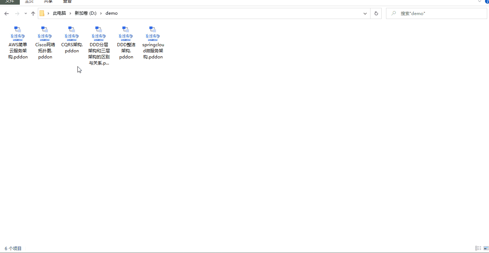
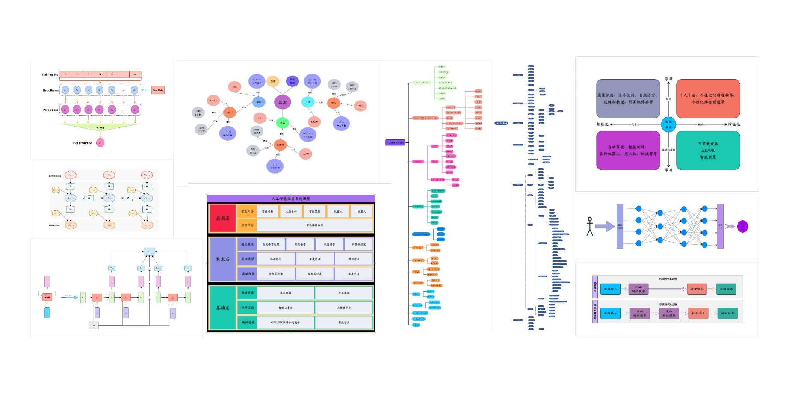
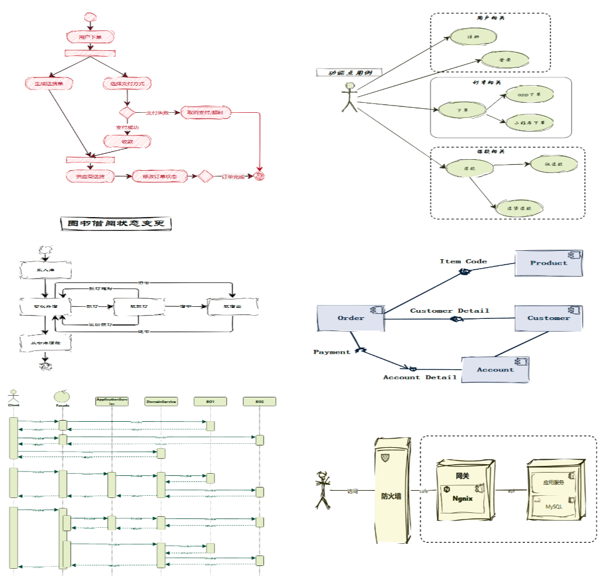
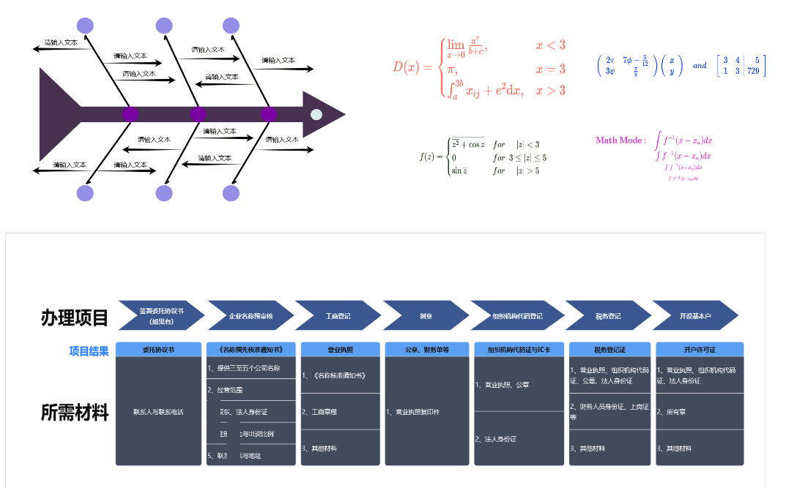
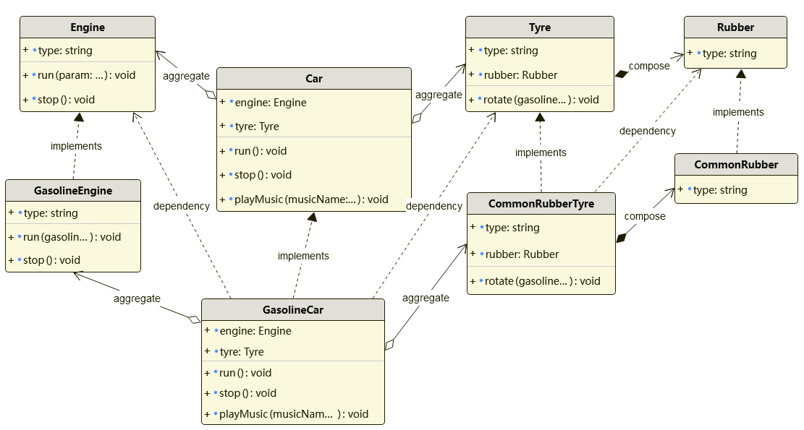

<h1>PDDON 支持lowcode的免费多功能专业在线画图工具</h1>

怕画不好图就用PDDON，可用于绘制流程图、架构图、思维导图、UML、BPMN、网络拓扑图、ER图、数据库模型图、韦恩图、鱼骨图等，并且支持对象建模、数据库建模、代码/脚本生成，提供了丰富的定制化绘图功能组件库，带来更贴心易用的设计体验。

* 在线画图地址: https://pddon.com
* windows桌面客户端安装包下载地址: https://github.com/pddon/pddon-win/releases/latest
* mac桌面客户端安装包下载地址: https://github.com/pddon/pddon-mac/releases/latest
* linux桌面客户端安装包下载地址: https://github.com/pddon/pddon-linux/releases/latest
* 桌面客户端安装包阿里云盘下载地址: [https://www.aliyundrive.com/s/bjatcSHPaK4](https://www.aliyundrive.com/s/bjatcSHPaK4)

> 如果觉得不错，可以点一个star哦，蟹蟹啦(#^.^#)  

PDDON可用于绘制流程图、架构图、思维导图、UML、BPMN、网络拓扑图、ER图、数据库模型图、韦恩图、鱼骨图等等。

同时非常贴心的为程序员用户提供了对象建模、数据库建模、代码生成等支持，而且支持一键修改整体样式、一键美化绘图、编辑、排版、多设计图协同编辑能力，类似Excel的简易操作方式。

支持latex语法输入数学公式、支持绘制手绘/草图风格绘图。预置了非常丰富的连线样式和组件供选择使用，连线、组件样式可以通过工具栏或者属性面板灵活调整，提供了自定义连线/组件DIY，支持使用和搜索网络组件、上传图片组件、预置了cisco、aws、阿里云、bpmn、uml相关组件库。

桌面版支持绘图数据永久保存、绘图数量不设上限、绘图大小不设上限、导出图片格式不限、支持高清大图，绘图功能不设限制，全部可用。可以导入、导出绘图设计稿且支持批量。下载图片格式丰富，支持png、jpg、svg、pdf、webp等等，更多好用功能就不一一列举了，等您来发现哦！

#### 使用示例
* PDDON桌面版简单使用示例
  
  
#### 下面带大家看看使用PDDON绘制的一些常用绘图

* AI 相关绘图

    

* 架构图

    

    

* 流程图

    

* UML 图

    

* 一些工作中的日常绘图

    

    

* 类图

    

* 数据库模型图

    

#### 其他信息

* 视频教程：https://space.bilibili.com/1293169179/video
* 微信公众号：PDDON在线画图
* 官方站点： https://pddon.com
* 技术支持邮箱: support@pddon.com
* QQ粉丝群：784463342 
* 客服微信号: anjoyhaha
